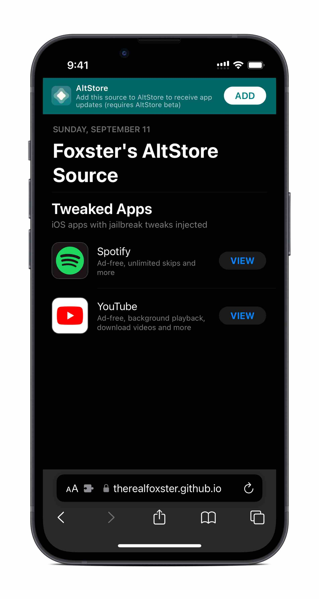
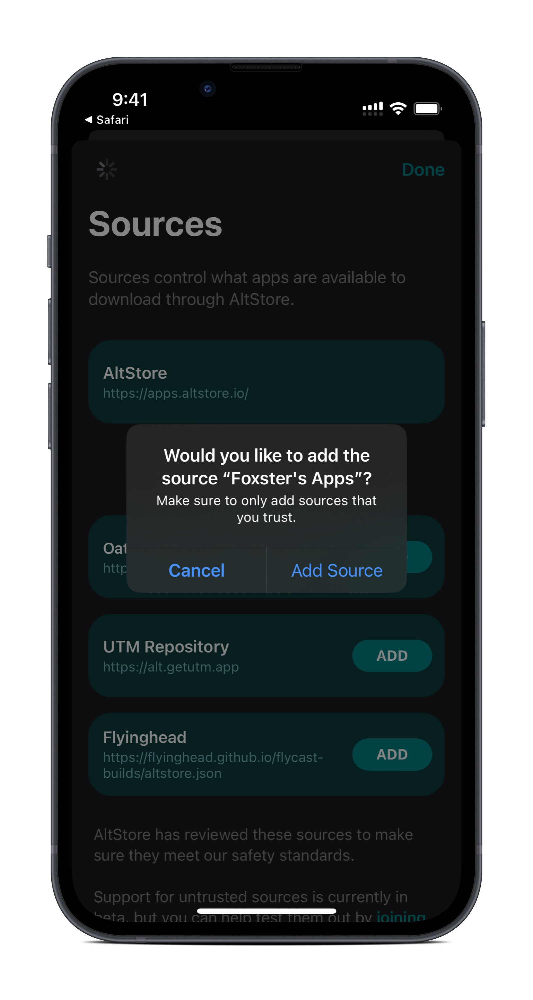
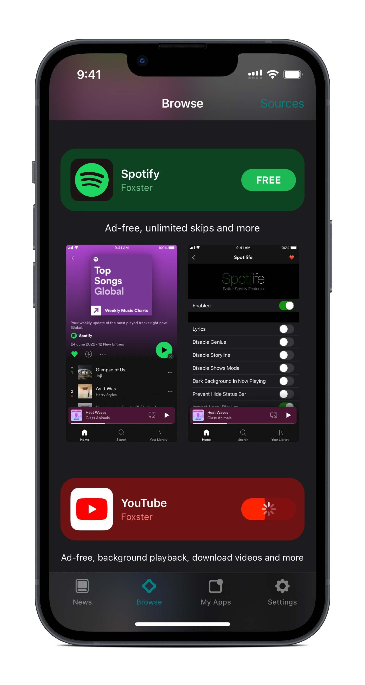
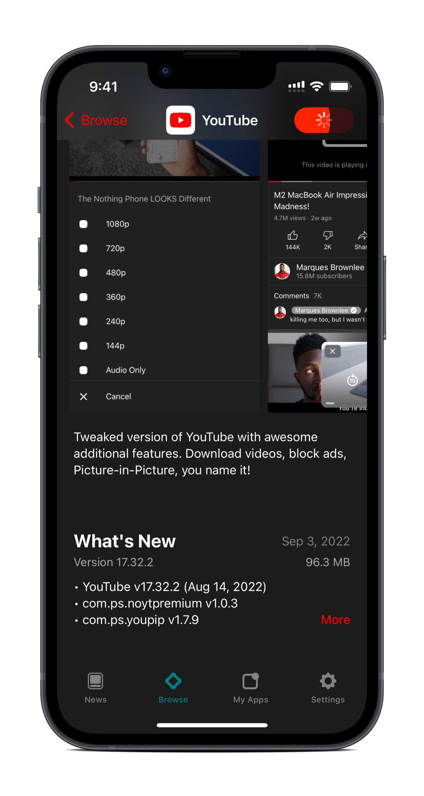
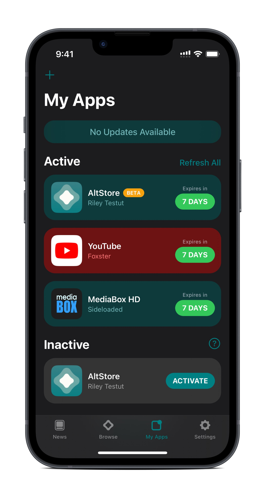

# Foxster's AltStore Source
AltStore source with tweak-injected apps and possibly more

Requires [AltStore beta](https://faq.altstore.io/patreon/beta-features/).

https://therealFoxster.github.io/altsource/

## Screenshots

## Q&A

**Why add a source when I can just download and sideload an .ipa file?**

By adding a source, you'll receive app updates directly through AltStore (as you would with any other app store) instead of having to dive around looking for and installing an .ipa file you may not know the origin of. I also have plans to open-source these tweak-injected apps (hopefully in the near future) for maximum transparency.

**How were these tweaked apps made?**

All of the tweaked apps available on the source were made with a decrypted .ipa file of the original app and tweaks pulled from a jailbroken device (the process was automated of course; I'm too lazy to be digging through hashed directories to hand-pick files lul). The tweaks were then injected into the app using [Azule](https://github.com/Al4ise/Azule).

**How often are these apps updated?**

I don't think I'll be able to dedicate a lot of time into this project so apps will only be updated when needed. Feel free to [let me know](#contact-me) if something breaks down the road!

## Credits
* [Riley Testut](https://github.com/rileytestut) - AltStore and AltStore beta
* [Martin Pelteshki](https://github.com/Al4ise) - Azule

## Contact Me
* Twitter: [@therealFoxster](https://twitter.com/therealFoxster)
