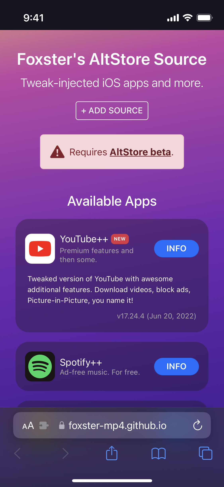
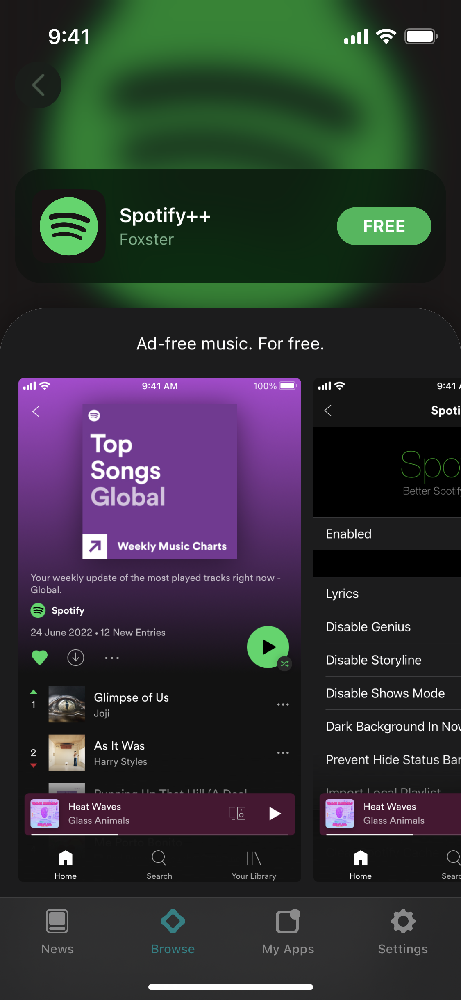

# Foxster's AltStore Source
### Tweak-injected apps for iOS and more.
A source for AltStore with tweaked apps (made by yours truly) and a number of other apps not found on the iOS App Store.

> ### Requires [AltStore beta](https://faq.altstore.io/patreon/beta-features/).

## Link to page
[https://foxster-mp4.github.io/AltSource/](https://foxster-mp4.github.io/AltSource/)

## Screenshots

## How were tweaks injected?
All of the tweaked apps available on the source were made with [Azule](https://github.com/Al4ise/Azule).

## Why add a source when I can just sideload the .ipa file normally?
By adding a source, you'll receive app updates directly through AltStore (as you would with any other app store) instead of having to dive around looking for and installing an .ipa file you may not know the origin of.

## How often are apps updated?
I don't think I'll be dedicating a lot of time into this project so I'll only be updating apps when needed. Feel free to [contact me](#contact-me) if something breaks down the road!

## Contact me
* Email: [huythefox@gmail.com](mailto:huythefox@gmail.com)
* Twitter: [@FoxsterPrivate](https://twitter.com/FoxsterPrivate)

## Credits
* AltStore and AltStore by [Riley Testut](https://github.com/rileytestut)
* Azule by [Martin Pelteshki](https://github.com/Al4ise)